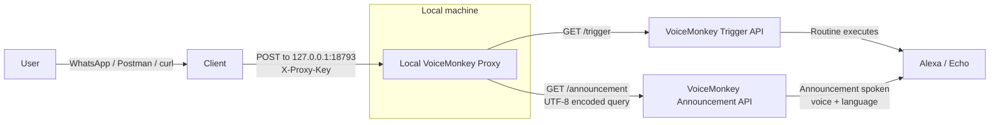

# Architecture diagram

GitHub supports Mermaid diagrams in Markdown.

```mermaid
flowchart LR
  U[User] -->|WhatsApp / Postman / curl| C[Client]
  C -->|POST to 127.0.0.1:18793<br/>X-Proxy-Key| P[Local VoiceMonkey Proxy]
  P -->|GET /trigger| VM1[VoiceMonkey Trigger API]
  P -->|GET /announcement<br/>UTF-8 encoded query| VM2[VoiceMonkey Announcement API]
  VM1 -->|Routine executes| A[Alexa / Echo]
  VM2 -->|Announcement spoken<br/>voice + language| A

  subgraph LocalMachine[Local machine]
    P
  end
```

If you want a PNG for sharing, you can copy the Mermaid block into https://mermaid.live and export.
